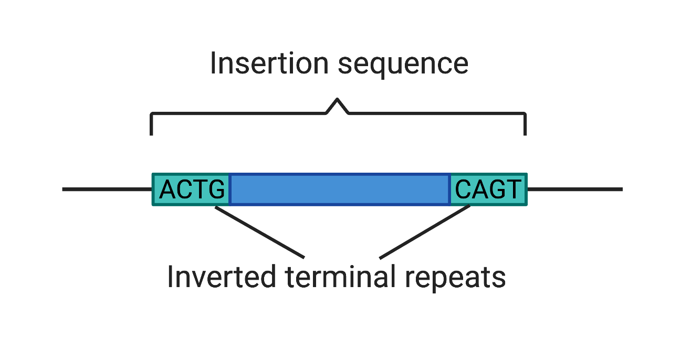

[](https://zenodo.org/badge/latestdoi/293755884)
[](https://github.com/blue-moon22/palidis/releases)


# **palidis** - **Pali**ndromic **D**etection of **I**nsertion **S**equences

## Contents
- [ Introduction ](#introduction)
- [ Description ](#description)
- [ Installation ](#installation)
- [ Usage ](#usage)
- [ Output ](#output)

<a name="introduction"></a>
## Introduction

Palidis is a tool that discovers novel insertion sequences.

The tool is based upon identifying inverted terminal repeats (ITRs) (figure below) using paired-end, short-read metagenomic data/mixed microbial genomes.

For each sample, palidis produces two output files: **1. FASTA file of insertion sequences** and **2. Information for each insertions sequence**



<a name="description"></a>
## Description
**Steps:**
1. Pre-process FASTQ.GZ reads [`convertToFasta`]
2. Efficient maximal exact matching to get repeat sequences using [pal-MEM](https://github.com/blue-moon22/pal-MEM) [`palmem`]
3. Map reads against assemblies using Bowtie2 [`filterContigs` `buildDB` `mapreads`]
4. Get candidate ITRs by distance filters [`getCandidateITRs`]
5. Cluster candidate ITRs using CD-HIT-EST [`clusterReads`]
6. Get putative ITRs by cluster concordance and output Insertion Sequences [`getITRs`]
7. Get insertion sequences [`runProdigal`, `installInterproscan`, `runInterproscan`, `getISInfo`]

<a name="installation"></a>
## Installation
- Install [Nextflow](https://www.nextflow.io/)
- Install [Docker](https://www.docker.com/) if using own machine or install [Singularity](https://sylabs.io/singularity/)/load a singularity module if using a shared HPC
- Clone this repo:
```bash
git clone --recursive -j8 https://github.com/blue-moon22/palidis.git
cd palidis
```
Note: You may be warned to first call `git config --global --add safe.directory`.
</br>If you have already cloned this repo with `git clone https://github.com/blue-moon22/palidis.git`, you also need to get the submodules `git submodule update --init --recursive`

<a name="usage"></a>
## Usage

```bash
nextflow palidis.nf --manifest <manifest_file> --batch_name <batch_name> -c configs/conf/<name_of_config>.config
```

### Mandatory arguments
#### `<batch_name>`

`<batch_name>` must be the directory that the output is stored in.

#### `<manifest_file>`

A tab-delimited manifest must be specified for `--manifest` containing the absolute paths with headers `lane_id`, `read_directory`, `sample_id` and `contigs_path`, e.g. this manifest contains three samples (the first having two lanes and the other two having one lane):

lane_id | read_directory | sample_id | contigs_path
:---: | :---: | :---: | :---:
lane1 | /path/to/file/lane1 | my_sample1 | /path/to/file/contigs.fasta
lane2 | /path/to/file/lane2 | my_sample1 | /path/to/file/my_sample1_contigs.fasta
lane3 | /path/to/file/lane3 | my_sample2 | /path/to/file/my_sample2_contigs.fasta
lane4 | /path/to/file/lane4 | my_sample3 | /path/to/file/my_sample3_contigs.fasta

#### `<name_of_config>`

This represents the institution or HPC name. You can find your institutional HPC's config in `configs/conf` (which is linked to the configs directory in [nf-core](https://github.com/nf-core)). For example, running on Sanger's HPC: `-c configs/conf/sanger.config`

### Optional arguments
```
  --min_itr_length    Minimum length of ITR. (Default: 25)
  --max_itr_length    Maximum length of ITR. (Default: 50)
  --kmer_length       k-mer length for maximal exact matching. (Default: 15)
  --min_is_len        Minimum length of insertion sequence. (Default: 500)
  --max_is_len        Maximum length of insertion sequence. (Default: 3000)
  --chunk_size        Number of protein sequences in each chunk for Interproscan. (Default: 80000)
  --lsf               Run Interproscan in LSF cluster mode. (Default: false)
  -resume             Resume the pipeline
```

### Testing
If you would like to test whether this pipeline produces the expected output on your system, run this command. If successful, it should print `Test passed. All outputs expected.`.
```
./tests/regression_tests.sh
```

<a name="output"></a>
## Output
There are two output files stored in a directory specified with `--batch_name`:

**1. FASTA file of insertion sequences**

**2. Information for each insertions sequence**

IS_name | sample_id | contig | is_start | is_end | description
:---: | :---: | :---: | :---: | :---: | :---:
IS_length_655-IPR002686_154_418-IPR002686_148_565-IPR036515_124_667-IPR036515_124_580-PTHR36966_133_625 | SRS013170 | NODE_18_length_76504_cov_9.77495 | 74408 | 75062 | IPR002686:Transposase IS200-like;IPR036515:Transposase IS200-like superfamily;PTHR36966:REP-ASSOCIATED TYROSINE TRANSPOSASE
IS_length_1455-IPR013762_1393_1918 | SRS013170 | NODE_31_length_64375_cov_7.58579 | 10034 | 11488 | IPR013762:Integrase-like, catalytic domain superfamily

### Interpretation
Header | Description
:--- | :---
**IS_name** | Name assigned by PaliDIS which contains the length, interpro or PANTHER accessions of transposases and their positions, e.g. `IS_length_655-IPR002686_154_418-IPR002686_148_565-IPR036515_124_667-IPR036515_124_580-PTHR36966_133_625` represents an IS of nucleotide length 655 with transposases detected including Interpro accession IPR002686 in positions 154-418 and 148-565, Interpro accession IPR036515 in position 124-667 and PANTHER accession PTHR36966 in position 133-625)
**sample_id** | Sample ID that was given in manifest
**contig** | Name of the contig that was given by the header in the contig file provided by the manifest
**is_start** | The start position of the IS on the contig
**is_end** | The end position of the IS on the contig
**description** | The description of each accession recorded in **IS_name**, e.g. IPR002686:Transposase IS200-like;IPR036515:Transposase IS200-like superfamily;PTHR36966:REP-ASSOCIATED TYROSINE TRANSPOSASE
